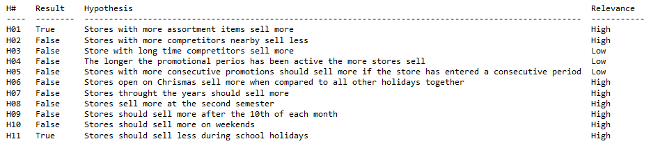
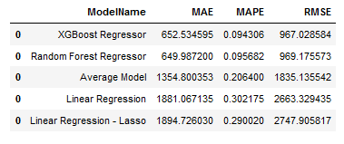
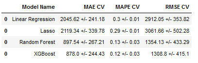
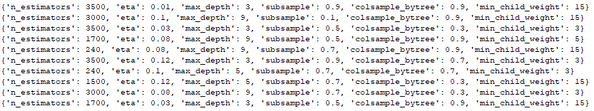
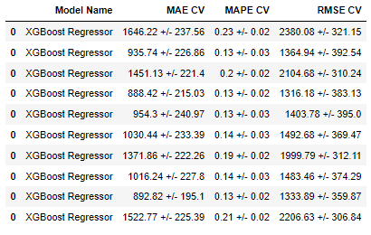
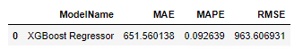
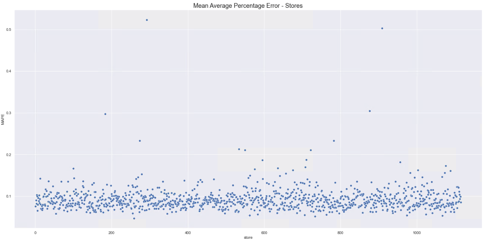
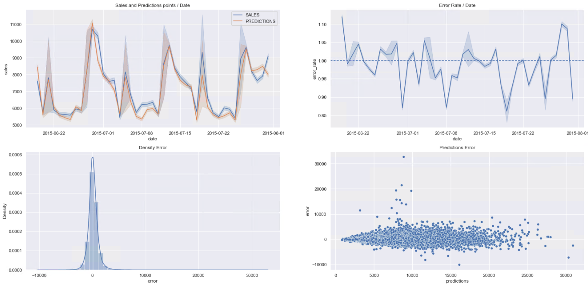
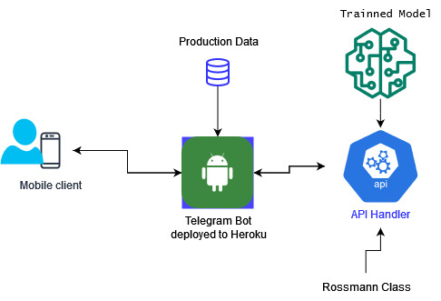
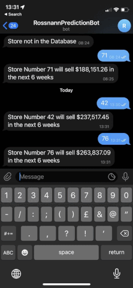

# Kaggle Rossmann dataset store sales prediction

This project was carried using the Rossmann dataset available at kaggle. The data contains daily sales for each store of the european drugstore chain.
The goal was to come up with a model to predict the sales for the next 6 weeks.
Besides the machine learning project it was developed a bot that runs on Heroku. The bot returns the prediction of each store. The bot can be accessed very easily by Telegram. The user just type the store number from his mobile phone to the telegram bot and it returns the prediction for that store.

You can check the complete Jupyter notebook for this project 

# Data

 | Name         					    | Description                                                                                                                                                                                                                                          |
 | ------------------------------------ | ---------------------------------------------------------------------------------------------------------------------------------------------------------------------------------------------------------------------------------------------------- |
 |   Id 								| an Id that represents a (Store, Date) tuple within the test set                                                                                                                                                                                     |
 |   Store 								| a unique Id for each store                                                                                                                                                                                                                          |
 |   Sales 								| the turnover for any given day (this is what you are predicting)                                                                                                                                                                                    |
 |   Customers 							| the number of customers on a given day                                                                                                                                                                                                              |
 |   Open 								| an indicator for whether the store was open: 0 = closed, 1 = open                                                                                                                                                                                   |
 |   StateHoliday						| indicates a state holiday. Normally all stores, with few exceptions, are closed on state holidays. Note that all schools are closed on public holidays and weekends.  - a = public holiday, b = Easter holiday, c = Christmas, 0 = None             |
 |   SchoolHoliday 						| indicates if the (Store, Date) was affected by the closure of public schools                                                                                                                                                                        |
 |   StoreType 							| differentiates between 4 different store models: a, b, c, d                                                                                                                                                                                         |
 |   Assortment 						| describes an assortment level: a = basic, b = extra, c = extended                                                                                                                                                                                   |
 |   CompetitionDistance 				| distance in meters to the nearest competitor store                                                                                                                                                                                                  |
 |   CompetitionOpenSince[Month/Year]	| gives the approximate year and month of the time the nearest competitor was opened                                                                                                                                                                  |
 |   Promo 								| indicates whether a store is running a promo on that day                                                                                                                                                                                            |
 |   Promo2 							| Promo2 is a continuing and consecutive promotion for some stores: 0 = store is not participating, 1 = store is participating                                                                                                                        |
 |   Promo2Since[Year/Week] 			| describes the year and calendar week when the store started participating in Promo2                                                                                                                                                                 |
 |   PromoInterval 						| describes the consecutive intervals Promo2 is started, naming the months the promotion is started anew. E.g. "Feb,May,Aug,Nov" means each round starts in February, May, August, November of any given year for that store                          |
 |   DayOfWeek    						| day of the week                                                                                                                                                                                                                                     |
 |   Date        						| date                                                                                                                                                                                                                                                |

# Data Description

Understanding the data is fundamental in order to develop a model. 
So in the first sections of the project the data has been described, which provided us a basic undestanding
of the data. Outliers were checked, missing data treated. Data was also split into numerical and categorical.

# Feature Engineering

At first it was done a brainstorm of ideas about the bussiness with the aim 
of helping better hypothesis formulation..

# Exploratory Data Analysis

At this step it has been conducted univariate, bivariate and multivariata analysis. 
Some hypothesis were tested:

# Machine Learning Modeling

Models evaluated:
- Average Model, Linear Regression, Lasso, Randon Forest, XGBoost

Data tested against the provided test dataset yielded the following results:

## Cross Validation

Cross validation was performed on tested models, the dataset was spread in 5 tests,
each one beggining at the end went backwards 6 weeks each time, always testing the next previous period for the 
data(check cross_validation function). The following results were obtained:

## Hyperparameter Fine Tuning

It was tried to improve the initial model by using Random Search, were evaluated 10 different
possibilities,  the tests were able to find a lesser error on the cross validation tests than the one in the model 
used before, even thoudh RMSE is the goal metric, because of the better error it has been decided to keep the new one.
Final results for Random Search:

- Final model chosen: 
{'n_estimators' : 1700, 'eta' : 0.08, 'max_depth':9, 'subsample':0.5, 'colsample_bytree':0.9,'min_child_weight': 5}

# Translating and Interpreting the error

It has been considered for the choice of the best trained model the RMSE and its error throught the cross validation process.

Mean Average Percentage Error according to the store has been put into a graphic:

# Machine Learning Model Performance

Error rate was also plotted, there are moments the error can oscilate depending on the prediction. 
When observing the Sales and Prediction points it is possible to see how well the prediction model fit. It can be further improved following a CRISP methodology a next improvement cycle.

# Deploy production model

Model has been deployed using Heroku. Both the Chatbot and the API Handler are hosted at Heroku.
You can find the coding files within this repository.

Chat bot:

